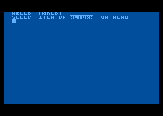
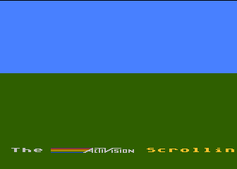
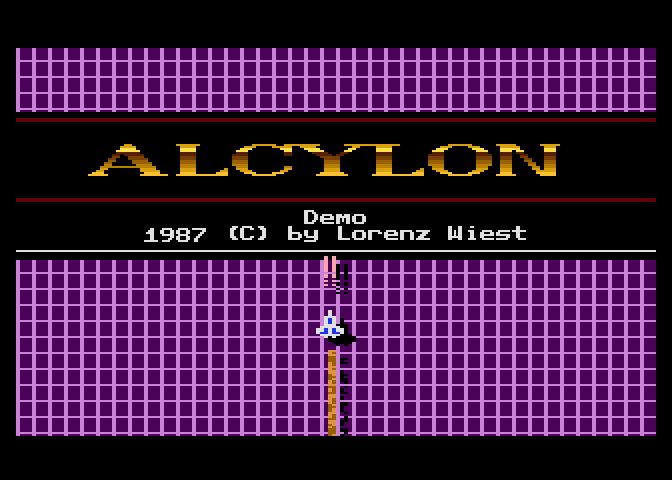

# Atari 6502 Assembler

Atari 6502 Assembler is an open-source 6502 assembler for the Atari 8-bit Home Computer System, written in Java.

I wrote this program mainly to assemble my [reverse-engineered, complete, and fully documented assembly language source code of STAR RAIDERS](https://github.com/lwiest/StarRaiders).

The accepted assembly language source code format is similar to the format of MAC/65 for the Atari 8-bit Home Computer System. 

The Atari 6502 Assembler source code is available under the MIT license.

Enjoy! -- Lorenz

## Table of Contents

* [Getting Started](#getting-started)
* [Command-Line Arguments](#command-line-arguments)
* [Command-Line Options](#command-line-options)
* [Assemble a Hello World Sample](#assemble-a-hello-world-sample)
* [Samples](#samples)
* [Documentation](#documentation)
* [Build Instructions](#build-instructions)

## Getting Started

I have prepared for you a [release](https://github.com/lwiest/Atari6502Assembler/releases/latest) of Atari6502Assembler.

### Prerequisites
* You have installed a Java SDK 5 (or higher) on your system.

### Instructions
1. Download [Atari6502Assembler.jar](https://github.com/lwiest/Atari6502Assembler/releases/download/v2.0/Atari6502Assembler.jar) to a folder.
2. Open a command prompt in that folder and enter:
   ``` 
   java -jar Atari6502Assembler.jar
   ```
This runs Atari 6502 Assembler and lists command-line options:
```
   _  _            _    __ ___  __ ___     _                     _    _
  /_\| |_ __ _ _ _(_)  / /| __|/  \_  )   /_\   ______ ___ _ __ | |__| |___ _ _
 / _ \  _/ _` | '_| | / _ \__ \ () / /   / _ \ (_-<_-</ -_) '  \| '_ \ | -_) '_|
/_/ \_\__\__,_|_| |_| \___/___/\__/___| /_/ \_\/__/__/\___|_|_|_|_.__/_|___|_|

Version 2.0 (08-MAR-2018) by Lorenz Wiest

Usage: java Atari6502Assembler [<options>] <infile> [<outfile>] [> <listfile>]

<options> (default values in {})
  -showHeader=true|false      | If true then print header line {true}
  -showObject=true|false      | If true then print object code {true}
  -showLineNumbers=true|false | If true then print line numbers {true}
  -showSymbolList=true|false  | If true then print symbol list {true}
  -lineNumberStart=<n>        | Set start line number {1}
  -lineNumberInc=<n>          | Set line number increment {1}
  -padLineNumbers=true|false  | If true then pad line numbers with "0" else with " " {true}
  -instructionPos=<n>         | Set column number of instructions {16}
  -labelExprPos=<n>           | Set column number of label expressions {16}
  -commentPos=<n>             | Set column number of comments. Ignored if 0. {0}
<infile>   - 6502 assembly language source code file
<outfile>  - Assembly output binary file
<listfile> - Assembly output listing file
```

## Command-Line Arguments

Argument     | Description
:------------|:-----------
`<infile>`   | The 6502 assembly language source code file
`<outfile>`  | The assembly output binary file (object file)
`<listfile>` | The assembly output listing file. Its content and format can be customized with several command-line options. If this argument is omitted, then the assembly output listing is printed to the console. 

## Command-Line Options

Option       | Values               | Description
:------------|:--------------------:|:-----------
`showHeader` | `true`,&nbsp;`false` | If `true` then print a header line (containing the date of the assembly) at the start of the assembly output listing (default: `true`).
`showObject` | `true`,&nbsp;`false` | If `true` then print the bytes of the object code, including the corresponding memory addresses, at the start of each line of the assembly output listing (default: `true`).
`showLineNumbers` | `true`,&nbsp;`false` | If `true` then number the lines of the assembly language source code in the assembly output listing (default: `true`). See also `lineNumberStart`, `lineNumberInc`, and `padLineNumbers`.
`showSymbolList` | `true`,&nbsp;`false` | If `true` then print the symbol list at the end of the assembly output listing (default: `true`).
`lineNumberStart` | `0`, `1`, `2`, ... | Sets the first line number of the assembly language source code. This number is a positive integer (default: `1`). See also `showLineNumbers`.
`lineNumberInc` | `1`, `2`, `3`, ... | Sets the line number increment for each line of the assembly language source code. This number is a positive integer (default: `1`). See also `showLineNumbers`.
`padLineNumbers` | `true`,&nbsp;`false` | If `true` then pad the line numbers with `0`, if `false` then pad the line numbers with " " (default: `true`). See also `showLineNumbers`.
`instructionPos` | `0`, `1`, `2`, ... | Sets the column number at which instructions are printed in the assembly output listing. This number is a positive integer. Column number 0 is the column of the first label character (default: `16`).
`labelExprPos` | `0`, `1`, `2`, ... | Sets the column number at which label expressions are printed in the assembly output listing. This number is a positive integer. Column number 0 is the column of the first label character (default: `16`).
`commentPos` | `0`, `1`, `2`, ... | Sets the column number at which comments are printed in the assembly output listing. This number is a positive integer. If this number is 0, then this option is ignored and comments are not rearranged in the assembly output listing. Comments at column number 0 are never rearranged in the assembly output listing. Column number 0 is the column of the first label character (default: `0`).

## Assemble a Hello World Sample

To assemble the sample program `HELLOWORLD.ASM` in folder [samples](samples) 
```
IOCB.EDTR = $00
PUTREC    = $09
BUFLEN    = $FF
CLS       = $7D
EOL       = $9B

RUNAD     = $02E0
ICCOM     = $0342
ICBADR    = $0344
ICBLEN    = $0348
CIO       = $E456

          *= $600
START     LDX #IOCB.EDTR*16
          LDA #PUTREC
          STA ICCOM,X
          LDA #<BUFFER
          STA ICBADR,X
          LDA #>BUFFER
          STA ICBADR+1,X
          LDA #<BUFLEN
          STA ICBLEN,X
          LDA #>BUFLEN
          STA ICBLEN+1,X
          JSR CIO
          RTS

BUFFER    .BYTE CLS,"HELLO, WORLD!",EOL

          *= RUNAD
          .WORD START
```
enter
```
java -jar Atari6502Assembler samples/HELLOWORLD/HELLOWORLD.ASM HELLOWORLD.EXE
```
Atari 6502 Assembler prints the following assembly output listing to the console:
```
Atari 6502 Assembler - Assembly Date: 14-Aug-2016

    =0000     01 IOCB.EDTR       = $00
    =0009     02 PUTREC          = $09
    =00FF     03 BUFLEN          = $FF
    =007D     04 CLS             = $7D
    =009B     05 EOL             = $9B
              06
    =02E0     07 RUNAD           = $02E0
    =0342     08 ICCOM           = $0342
    =0344     09 ICBADR          = $0344
    =0348     10 ICBLEN          = $0348
    =E456     11 CIO             = $E456
              12
              13                 *= $600
0600 A200     14 START           LDX #IOCB.EDTR*16
0602 A909     15                 LDA #PUTREC
0604 9D4203   16                 STA ICCOM,X
0607 A91F     17                 LDA #<BUFFER
0609 9D4403   18                 STA ICBADR,X
060C A906     19                 LDA #>BUFFER
060E 9D4503   20                 STA ICBADR+1,X
0611 A9FF     21                 LDA #<BUFLEN
0613 9D4803   22                 STA ICBLEN,X
0616 A900     23                 LDA #>BUFLEN
0618 9D4903   24                 STA ICBLEN+1,X
061B 2056E4   25                 JSR CIO
061E 60       26                 RTS
              27
061F 7D48454C 28 BUFFER          .BYTE CLS,"HELLO, WORLD!",EOL
0623 4C4F2C20
0627 574F524C
062B 44219B  
              29
              30                 *= RUNAD
02E0 0006     31                 .WORD START

SYMBOLS (SORTED BY NAME): 12

 061F  BUFFER
=00FF  BUFLEN
=E456  CIO
=007D  CLS
=009B  EOL
=0344  ICBADR
=0348  ICBLEN
=0342  ICCOM
=0000  IOCB.EDTR
=0009  PUTREC
=02E0  RUNAD
 0600  START

SYMBOLS (SORTED BY VALUE): 12

=0000  IOCB.EDTR
=0009  PUTREC
=007D  CLS
=009B  EOL
=00FF  BUFLEN
=02E0  RUNAD
=0342  ICCOM
=0344  ICBADR
=0348  ICBLEN
 0600  START
 061F  BUFFER
=E456  CIO
```
and writes the following object code to file `HELLOWORLD.EXE`: 
```
0000 | FF FF 00 06 2D 06 A2 00 A9 09 9D 42 03 A9 1F 9D |....-......B....|
0010 | 44 03 A9 06 9D 45 03 A9 FF 9D 48 03 A9 00 9D 49 |D....E....H....I|
0020 | 03 20 56 E4 60 7D 48 45 4C 4C 4F 2C 20 57 4F 52 |. V.`}HELLO, WOR|
0030 | 4C 44 21 9B E0 02 E1 02 00 06                   |LD!.......|
```
You can run the object code with your Atari 8-bit Home Computer System emulator (I use Atari800Win PLus). It prints the message "HELLO, WORLD!" to the screen.

## Samples

The folder [samples](samples) contains some sample 6502 assembly language programs that I wrote for the Atari 8-bit Home Computer System. Find for each sample the following files:
* Source code file (\*.ASM)
* Assembly output listing file (\*.LST)
* Object file (\*.EXE)
* Screenshot (\*.GIF):

### HELLOWORLD



Prints the message "HELLO, WORLD!" to the screen.

### ACTIVISION



Recreates the scrolling bottom banner of Activision games.

### ALCYLON



The intro of a vertically scrolling spaceship game I wrote in 1987 (the intro, not the game ;-). After the intro has finished you can move the spaceship left and right with the joystick and fire photon torpedoes with the joystick button. I refactored and polished the old source code and re-assembled it with Atari 6502 Assembler (It's nice to write assembly language source code in lines of more than 40 characters :-).

## Documentation

Atari 6502 Assembler assembles 6502 assembly language source code into an object file for the Atari 8-bit Home Computer System.

The accepted assembly language source code format is similar to the format of MAC/65 for the Atari 8-bit Home Computer System. 

### Notation

Symbol | Description
:-----:|:-----------
\[ \]  | Content enclosed in square brackets (\[ \]) is optional.
\*     | Optional content followed by an asterisk (\*) may be repeated several times.
\|     | Indicates a choice of the content either to the left or to the right of the bar (\|).

### Assembler Input

Atari 6502 Assembler breaks down each line of the assembly language source code into the following elements:

\[\<linenumber\>\<whitespace\>\] \[\<sourceline\>\]

with

**\<sourceline\>** ::= \<label\>\|\<whitespace\> \[\<instruction\> \[\<operand\>\]\] \| \[\<directive\>\] \[\<comment\>\]

All elements may be separated by an arbitrary number of whitespace characters – with **one exception**: There must be **exactly one whitespace character** between a line number and the source line.

**Examples:**
```
100 START = $3000 ; OK: 1 whitespace between line number and label START
110  *= START     ; OK: 2 whitespaces between line number and directive *=
120  LDX #0       ; OK: 2 whitespaces between line number and instruction LDX
130 LOOP INX   
140  CPX #10
150  BNE LOOP
160  END NOP      ; ERROR: 2 whitespaces between line number and label END
160 RTS           ; ERROR: 1 whitespace between line number and instruction RTS
```

**\<linenumber\>**	- A line number between `0`..`99999`, which is discarded. It is accepted for compatibility reasons to read assembly language source code with leading line numbers.

**\<whitespace\>**	- One whitespace character.

**\<label\>** 	- A label starts with a letter `A`..`Z` or `a`..`z`, an at-sign (`@`), a question mark (`?`), or a colon (`:`). The remaining characters may be letters `A`..`Z` or `a`..`z`, digits `0`..`9`, an at-sign (`@`), a question mark (`?`), a colon (`:`), or a period (`.`).

When a label starts with a question mark (`?`) or a colon (`:`), then it is not included in the symbol table that is printed at the end of the assembly output listing.

Labels are case-insensitive, for example, label `START` is the same as label `start`.

**Note:** Colons in labels are not supported by MAC/65.

**\<instruction\>**	- One of the following 6502 instructions: `ADC`, `AND`, `ASL`, `BCC`, `BCS`, `BEQ`, `BIT`, `BMI`, `BNE`, `BPL`, `BRK`, `BVC`, `BVS`, `CLC`, `CLD`, `CLI`, `CLV`, `CMP`, `CPX`, `CPY`, `DEC`, `DEX`, `DEY`, `EOR`, `INC`, `INX`, `INY`, `JMP`, `JSR`, `LDA`, `LDX`, `LDY`, `LSR`, `NOP`, `ORA`, `PHA`, `PHP`, `PLA`, `PLP`, `ROL`, `ROR`, `RTI`, `RTS`, `SBC`, `SEC`, `SED`, `SEI`, `STA`, `STX`, `STY`, `TAX`, `TAY`, `TSX`, `TXA`, `TXS`, `TYA`.

Instructions are case-insensitive.

**\<operand\>**	- The operand of the instruction. An operand has one of the following formats:

Operand             | Format                                | Example
:-------------------|:--------------------------------------|:---------
Implied             | N/A                                   | `CLC`
Accumulator	    | `A`                                   | `LSR A`
Immediate           | `#`\<argument\>                       | `LDA #0`
Absolute            | \<argument\>                          | `LDA $1000`
Absolute, Zero Page | \<argument\>                          | `LDA $80`
Indexed             | \<argument\>`,X` or \<argument\>`,Y`  | `LDA $1000,X`
Indexed, Zero Page  | \<argument\>`,X` or \<argument\>`,Y`  | `LDA $80,X`
Indirect            | `(`\<argument\>`)`                    | `JMP ($8000)`
Indexed indirect    | `(`\<argument\>`,X)`                  | `LDA ($80,X)`
Indirect indexed    | `(`\<argument\>`),Y`                  | `LDA ($80),Y` 
Relavtive           | \<argument\>                          | `BNE $03` 

**\<argument\>** 	- An argument is one of the following:

Argument             | Examples     | Description
:--------------------|:-------------|:-----------
Decimal constant     | `1`, `1234`      | A 16-bit integer number, uses digits `0`..`9`
Hexadecimal constant | `$1`, `$FFFF`    | A 16-bit integer number, starts with a dollar sign (`$`), followed by 1 to 4 characters out of `0`..`9`, `A`..`F`, and `a`..`z`. Hexadecimal constants are case-insensitive.
Binary constant      | `%1`, `%1010`    | A 16-bit integer number, starts with a percent sign (`%`), followed by 1 to 16 characters out of `0`..`1`. **Note:** Binary constants are not supported by MAC/65.
Character constant   | `'A`           | A single quote (`'`), followed by an ASCII character
Label                | `START`, `FOO`   | See above
Expression           | `START+$1F`    | See [Expressions](#expressions)

**\<directive\>** 	- A directive, see [Directives](#directives)

**\<comment\>**	- A comment. It starts with a semicolon (`;`) and ends at the end of the line.

### Expressions

An expression is a combination of arguments and operators. It is evaluated to a 16-bit unsigned number, ignoring overflows. The following operators are supported:

Operator | Description                       | Example       | Result
:-------:|:----------------------------------|:--------------|:------
`+`      | Addition                          | `40+20`       | 60
&nbsp;   | &nbsp;                            | `$F000+$2000` | $1000 (4096)
`-`      | Subtraction                       | `40-20`       | 20
`*`      | Multiplication                    | `2*3`         | 6
`/`      | Division                          | `12/2`        | 6
&nbsp;   | &nbsp;                            | `12/5`        | 2
`-`      | Minus (unary)                     | `-1`          | 65535 ($FFFF)
`&`      | Binary AND                        | `$03&$01`     | $0001 (1)
`!`      | Binary OR                         | `$02!$01`     | $0003 (3)
`^`      | Binary XOR                        | `$03^$01`     |$0002 (2)
`<`      | Low order byte of a word (unary)  | `<$1234`      | $0034
`>`      | High order byte of a word (unary) | `>$1234`      | $0012
`[ ]`    | Parentheses                       | `[2+3]*4`     | 24

The operator precedence is (from highest to lowest):

Precedence | Operators
:---------:|:----------
1          | `[ ]`
2          | `<`, `>`, `-` (unary)
3          | `*`, `/`
4          | `+`, `-`
5          | `&`, `!`, `^`

### Directives

#### Origin (\*=)

**Syntax:** `*=` \<expression\>

Sets the assembler's program counter to the value of the expression.  

**Example:** `*= $1000` sets the program counter to $1000.

#### Label Expression (=)

**Syntax:** \<label\> `=` \<expression\>

Assigns the value of an expression to a label.  

**Example:** `PMBASE = $1000` assigns the value $1000 to the label `PMBASE`.

#### .BYTE

**Syntax:** `.BYTE` \<expression\>\|\<string\>\[`,` \<expression\>\|\<string\>\]\*
	
Generates individual bytes of object code. For expressions, the low order byte of the expression value is added to the object code. For strings, that is ASCII characters enclosed in double quotes (`"`), each character produces a byte, which is added to the object code.  

**Example:** `.BYTE 1,-1,1+2,"HELLO",'!` produces `01 FF 03 48 45 4C 4C 4F 21`

#### .WORD

**Syntax:** `.WORD` \<expression\>\[`,` \<expression\>\]\*

Generates individual 16-bit words of object code. First, the low order byte of the expression value is added to the object code, then the high order byte of the expression value is added to the object code.  

**Example:** `.WORD 1,-1,$1234` produces `01 00 FF FF 34 12`

## Build Instructions

**Prerequisites:** You have Java SDK 5 (or higher) installed on your system.

Download this project's ZIP file from GitHub and unzip it to a temporary folder ("root" folder).

**To work with the Atari 6502 Assembler source code in your Eclipse IDE**, import the `Atari6502Assembler` project in your Eclipse IDE from the root folder, choosing as import source _General > Existing Projects into Workspace_.

**To compile Atari 6502 Assembler into a convenient JAR file** (Windows only), open a command prompt in the root folder and enter (`%JAVA_HOME%` must point to the installation folder of your Java SDK):
```
makejar
```
This produces the `Atari6502Assembler.jar` file.
